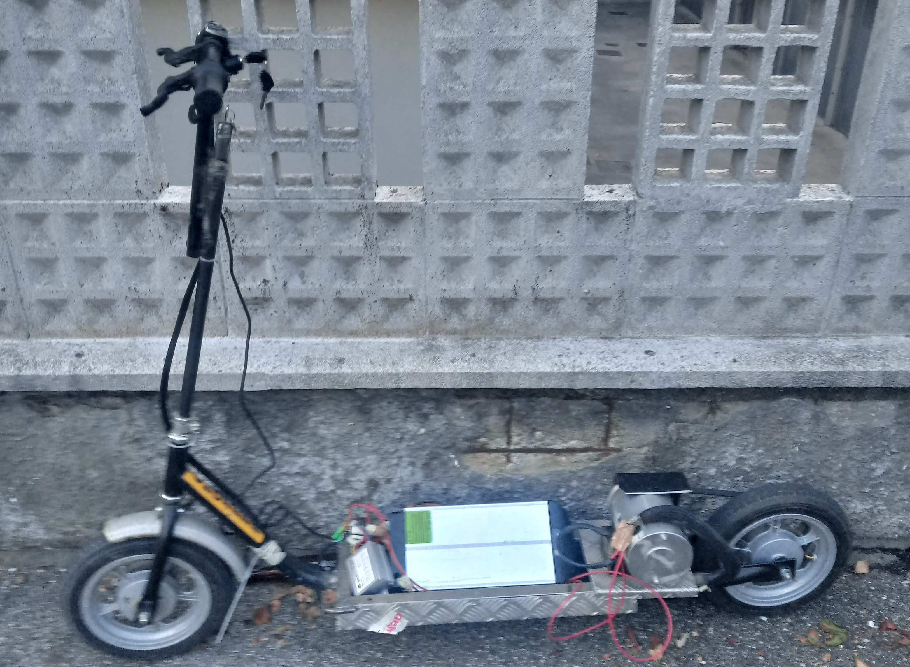

# Monopattino Elettrico

---

<!-- Monopattino elettrico -->

  

  
  

  
  

Creazione di un monopattino elettrico con materiali di recupero.

<h3>
Disclaimer
</h3>

`<i>`Ogni azione di replicazione del `<b>`Monopattino `</b>` è sotto la vostra responsabilità. L'uso scorretto di un oggetto come quello documentato può risultare in `<b>`problemi legali `</b>` nei confronti del responsabile. `<b>`I contributori non saranno ritenuti responsabili `</b>` nel caso di un uso scorretto del progetto da parte di un'individuo.

`<b>`Questo progetto può non essere `</b>`. Refer to the laws in your province/country before accessing, using,or in any other way utilizing this in a wrong way.

`<b>`This Project is made for educational purposes only `</b>`. Do not attempt to violate the law `<b>`If this is your intention, then Get the hell out of here `</b>`!

### Features

- Acceleratore a manopola
- Pedana rialzabile
- Batteria al litio
- Documento di analisi fisica del progetto

<h3 align="center">
:: Workflow ::
</h3>

### Special Thanks :

- [**Pietro Saluzzi**](https://github.com/adi1090x)

### Find Me on :

  
  

